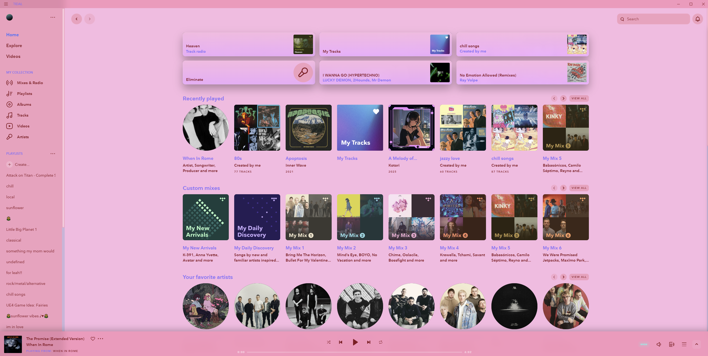
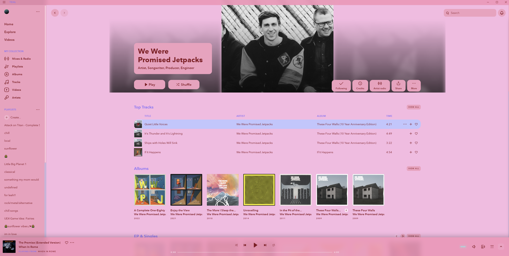
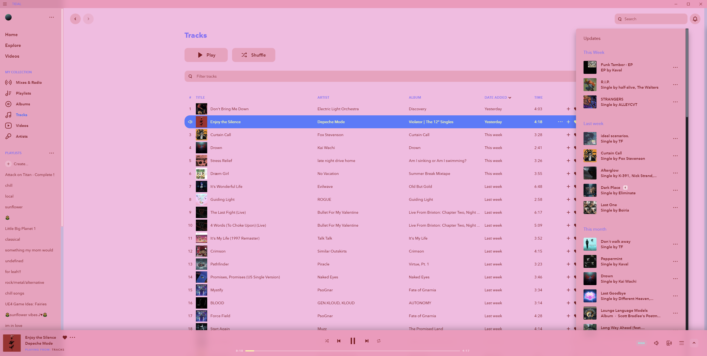
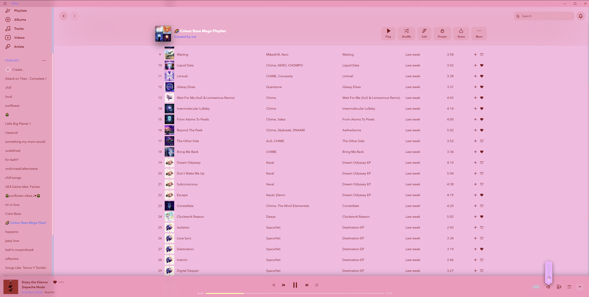

# TidalCustomTheme

Tidal customizable theme.

To install, first get Neptune via https://github.com/uwu/neptune

Then, install https://github.com/Inrixia/neptune-plugins?tab=readme-ov-file#Themer

Open the editor and paste the theme.css code.

Preview:

